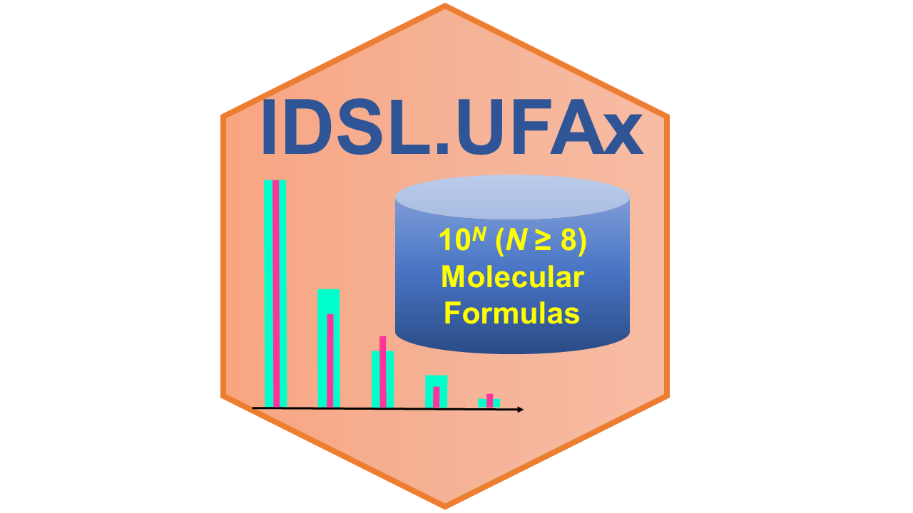

# IDSL.UFAx

<!-- badges: start -->

<!-- badges: end -->

A pipeline to annotate a number of peaks from the [**IDSL.IPA**](https://github.com/idslme/IDSL.IPA) peaklists using an exhaustive chemical enumeration-based approach. This package can perform elemental composition calculations using the following 15 elements : C, B, Br, Cl, K, S, Se, Si, N, H, As, F, I, Na, O, and P.

	install.packages("IDSL.UFAx")

**Note:** The IDSL.UFAx package has a dependency on [RcppAlgos](https://github.com/jwood000/RcppAlgos) and gmp R packages. In some instance to install these two packages, you may need to run the following command on a linux terminal

	sudo apt-get install libgmp-dev

## Workflow
To annotate your mass spectrometry data (**mzXML**, **mzML**, **netCDF**), mass spectrometry data should be processed using the [IDSL.IPA](https://github.com/idslme/IDSL.IPA) workflow to acquire chromatographic information of the peaks (***m/z-RT***). When the chromatographic information of individual peaklists were generated using the [IDSL.IPA](https://github.com/idslme/IDSL.IPA) workflow, download the [UFAx parameter spreadsheet](https://raw.githubusercontent.com/idslme/IDSL.UFAx/main/UFAx_parameters.xlsx) and select the parameters accordingly and then use this spreadsheet as the input for the IDSL.UFAx workflow:

		library(IDSL.UFA)
		library(IDSL.UFAx)
		UFAx_workflow("Address of the UFAx parameter spreadsheet")

Visit https://ufa.idsl.me/enumerating-chemical-space/exhaustive-enumeration for the detailed documentation and tutorial.

## Ultra exhaustive enumeration
IDSL.UFAx applies a hursitic approach to enumerate vast chemical spaces (<1027 molecular formulas). Although, the IDSL.UFAx approach is computationally expensive, it is very suitable for elemental composition of unknown peaks when the chemical space is unidentifiable.

## Citation
Fakouri Baygi, S., Banerjee S. K., Chakraborty P., Kumar, Y. Barupal, D.K. [IDSL.UFA assigns high confidence molecular formula annotations for untargeted LC/HRMS datasets in metabolomics and exposomics](https://pubs.acs.org/doi/10.1021/acs.analchem.2c00563). *Analytical Chemistry*, **2022**.

Fakouri Baygi, S., Kumar, Y. Barupal, D.K. [IDSL. IPA characterizes the organic chemical space in untargeted LC/HRMS datasets](https://pubs.acs.org/doi/10.1021/acs.jproteome.2c00120). *Journal of proteome research*, **2022**, *21(6)*, 1485-1494.
