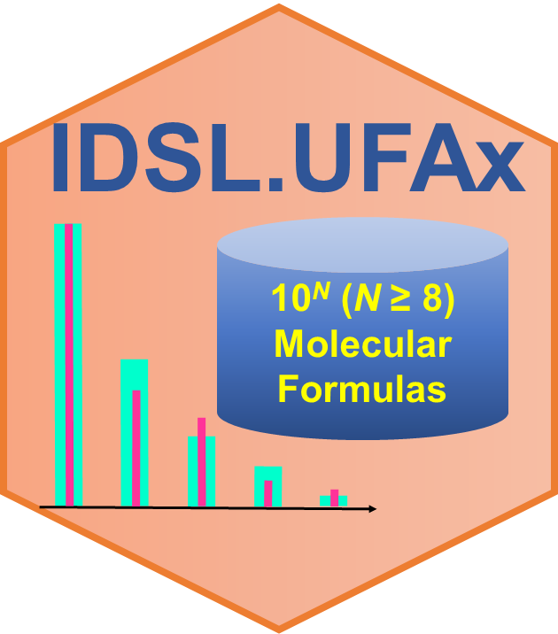

# IDSL.UFAx

<!-- badges: start -->

<!-- badges: end -->

A pipeline to annotate a number of peaks from the IDSL.IPA peaklists using an exhaustive chemical enumeration-based approach. This package can perform elemental composition calculations using following 15 elements : C, B, Br, Cl, K, S, Se, Si, N, H, As, F, I, Na, O, and P.

Visit https://ufa.idsl.me/enumerating-chemical-space/exhaustive-enumeration for the detailed documentation and tutorial.

# Note
IDSL.UFAx package has a dependency on RcppAlgos and gmp R packages. In some instance to install these two packages, you may need to run the following command on a linux terminal

	sudo apt-get install libgmp-dev